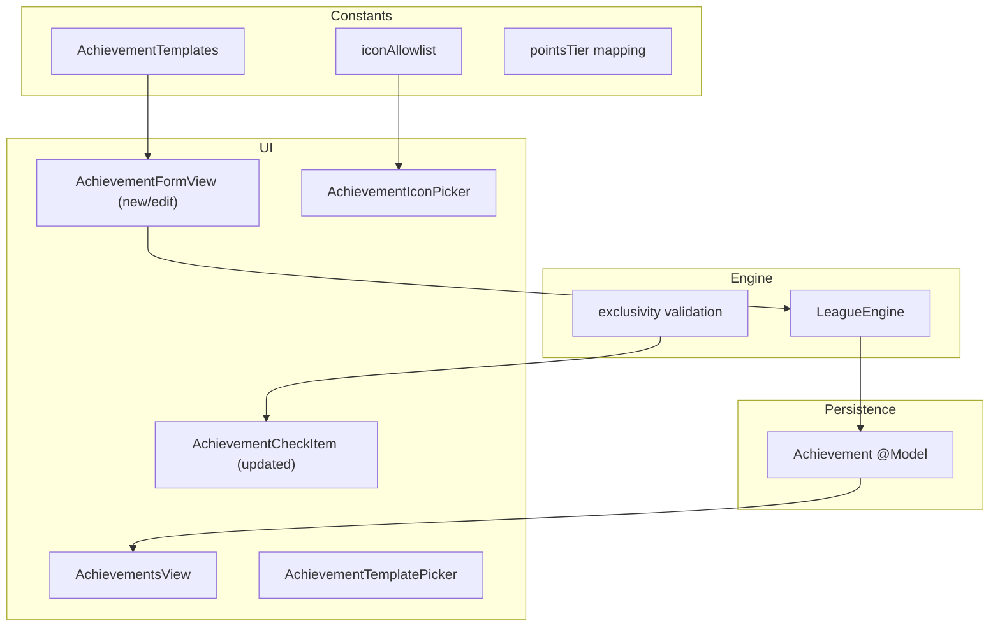

# Achievement improvements — implementation plan

**Last updated:** 2026-06-16  
**Status:** **Ongoing** — Sprints A1–A4 implemented; A5 (a11y sign-off) pending  
**Perspective:** League host at the table designing and scoring achievements.  
**Normative spec:** [specs/AchievementSpec.md](../specs/AchievementSpec.md)

This document is the **ongoing implementation plan** for Achievement v2: richer metadata, icon picker, templates, points tiers, edit flow, exclusivity rules, and game-night surfaces.

### Sprint tracker

| Sprint | Scope | Status |
|--------|-------|--------|
| **A1** | Schema, migration, engine CRUD, exclusivity helpers | Done |
| **A2** | Templates + `AchievementFormView` | Done |
| **A3** | Icon picker + list polish + balance card | Done |
| **A4** | Game-night UI + exclusivity enforcement | Done |
| **A5** | A11y, UI tests, playtest sign-off | Pending |

---

## Goals

| Goal | Success signal |
|------|----------------|
| Hosts can **explain** achievements without memorizing names | Description visible on Pods tab and in scoring |
| Hosts can **balance** points intuitively | Tier picker with placement context copy |
| Hosts can **brand** achievements | SF Symbol icon per achievement, changeable anytime |
| Hosts can **fix mistakes** | Full edit sheet, not just always-on toggle |
| Scoring respects **table rules** | One-per-pod and once-per-week enforced in UI |
| New hosts get **started fast** | Template library on add |

---

## Non-goals (this initiative)

- Custom image uploads
- Per-tournament achievement catalogs
- Achievement search / tags beyond category
- Changing historical `GameResult` when editing an achievement

---

## Current state (v1)

| Area | Today |
|------|-------|
| Model | `name`, `points`, `alwaysOn` |
| Add UI | `NewAchievementView` — name, points stepper, always-on toggle |
| Edit | Toggle always-on + remove only; **no full edit** |
| Scoring UI | `AchievementCheckItem` — name + `+N` toggle |
| Pods preview | Name + points list |
| Templates | None (demo loader seeds 2 sample achievements in UI test bootstrap only) |
| Icons | None |

**Key files:**

- `BudgetLeagueTracker/Models/Achievement.swift`
- `BudgetLeagueTracker/Views/NewAchievementView.swift`
- `BudgetLeagueTracker/ViewModels/NewAchievementViewModel.swift`
- `BudgetLeagueTracker/Views/AchievementsView.swift`
- `BudgetLeagueTracker/ViewModels/AchievementsViewModel.swift`
- `BudgetLeagueTracker/Components/AchievementCheckItem.swift`
- `BudgetLeagueTracker/Engine/LeagueEngine.swift` (`addAchievement`, `rollActiveAchievements`)

---

## Architecture overview



**Pattern:** Keep MVVM + Engine. Form ViewModel shared for new/edit. Templates are static constants, not SwiftData entities.

---

## Phase 0 — Spec & scaffolding

**Duration:** ~0.5 day  
**Dependencies:** None

| Task | Deliverable |
|------|-------------|
| Land normative spec | `specs/AchievementSpec.md` ✅ |
| Land this plan | `docs/achievement-improvements-plan.md` ✅ |
| Update indexes | `specs/README.md`, `docs/README.md`, `SpecGovernance.md` |
| Update feature inventory | Achievements → Partial; v2 rows → Planned |
| Add roadmap phase | `docs/ios-roadmap.md` Phase 4 entry |

**Exit criteria:** PR merges docs only; team agrees scope and phasing.

---

## Phase 1 — Data model & migration

**Duration:** ~1–2 days  
**Dependencies:** Phase 0

### 1.1 New types

Create `BudgetLeagueTracker/Models/AchievementCategory.swift` (or colocate with `Achievement.swift`):

```swift
enum AchievementCategory: String, Codable, CaseIterable, Identifiable {
    case combat, deckbuilding, social, chaos, seasonal, custom
    var id: String { rawValue }
    var displayName: String { ... }
    var defaultIconName: String { ... }
}

enum AchievementExclusivity: String, Codable, CaseIterable, Identifiable {
    case unlimited, onePerPod, onePerWeekPerPlayer
    var id: String { rawValue }
    var displayName: String { ... }
    var footnote: String { ... }
}

enum AchievementPointsTier: String, CaseIterable, Identifiable {
    case small, standard, big, trophy
    var points: Int { ... }
    var displayName: String { ... }
    var placementContext: String { ... }
}
```

### 1.2 Extend `Achievement` @Model

Add properties per spec §2.1. Use computed wrappers for type-safe access:

```swift
var category: AchievementCategory {
    get { AchievementCategory(rawValue: categoryRaw) ?? .custom }
    set { categoryRaw = newValue.rawValue }
}
```

**SwiftData note:** Property `achievementDescription` avoids `description` reserved/conflict issues.

### 1.3 Schema migration

| Approach | Recommendation |
|----------|----------------|
| Lightweight migration | Add optional/new fields with defaults in `init` and migration plan |
| Versioned schema | If lightweight fails in testing, introduce `SchemaV2` in `BudgetLeagueTrackerApp` |

**Migration test:** Deferred until post–1.0 (no shipped stores). Pre-release: delete simulator app when the model changes.

### 1.4 Constants

Extend `AppConstants.swift`:

```swift
enum Achievement {
    static let nameMaxLength = 80
    static let descriptionMaxLength = 200
    static let pointsRange = 0...99
    static func pointsTier(for points: Int) -> AchievementPointsTier
    static func points(for tier: AchievementPointsTier) -> Int
    static let iconAllowlist: [String]  // grouped by category for picker
}
```

### 1.5 Engine — create & update

- Extend `LeagueEngine.addAchievement(...)` with new parameters (defaults preserve call sites).
- Add `LeagueEngine.updateAchievement(...)` per spec §9.
- Add sanitizers: trim strings, clamp points, validate icon against allowlist.

### 1.6 Tests

| File | Coverage |
|------|----------|
| `AchievementTests.swift` | New fields, computed enums, defaults |
| `LeagueEngineTests.swift` | `addAchievement` / `updateAchievement` validation |
| `AchievementMigrationTests.swift` | v1 → v2 defaults |

**Exit criteria:** All unit tests green; existing app launches with migrated catalog.

---

## Phase 2 — Template catalog

**Duration:** ~1 day  
**Dependencies:** Phase 1

### 2.1 Template struct

`BudgetLeagueTracker/Models/AchievementTemplate.swift`:

```swift
struct AchievementTemplate: Identifiable {
    let id: String
    let name: String
    let achievementDescription: String
    let points: Int
    let alwaysOn: Bool
    let category: AchievementCategory
    let iconName: String
    let exclusivity: AchievementExclusivity
}
```

### 2.2 Static catalog

`BudgetLeagueTracker/Constants/AchievementTemplates.swift` — 10 templates per spec §5.2.

Update `DemoLeagueLoader.seedSampleAchievements` to use templates or match template definitions for consistency.

Update `AppConstants.DefaultAchievement` / bootstrap seed to include description + icon for First Blood:

| Field | Value |
|-------|-------|
| name | First Blood |
| description | First player to eliminate another player |
| points | 1 |
| alwaysOn | false |
| category | combat |
| icon | `flame.fill` |
| exclusivity | onePerPod |

### 2.3 Tests

`AchievementTemplatesTests` — count, unique names, all icons in allowlist.

**Exit criteria:** Templates compile; demo/bootstrap data aligned.

---

## Phase 3 — Achievement form (builder UI)

**Duration:** ~3–4 days  
**Dependencies:** Phase 1–2

### 3.1 ViewModel

Replace / generalize `NewAchievementViewModel` → `AchievementFormViewModel`:

| State | Notes |
|-------|-------|
| `mode: .add \| .edit(achievementId:)` | |
| `name`, `achievementDescription`, `points`, `alwaysOn`, `category`, `iconName`, `exclusivity` | |
| `selectedPointsTier` | Synced with `points`; custom points breaks tier sync |
| `iconManuallySelected: Bool` | Category change suggests icon only when false |
| `apply(template:)` | Pre-fill all fields |
| `apply(achievement:)` | For edit / duplicate |
| `save()` | Calls `addAchievement` or `updateAchievement` |

### 3.2 Views

| View | Responsibility |
|------|----------------|
| `AchievementFormView` | Full builder; replaces `NewAchievementView` |
| `AchievementPreviewCard` | Live preview per spec §6.2 |
| `AchievementPointsTierPicker` | Segmented or vertical radio list with placement context |
| `AchievementTemplatePickerView` | Sheet step before form when adding |

### 3.3 Navigation flows

**Add:**

1. Tap + on Achievements tab
2. `AchievementTemplatePickerView`: "Blank custom" + template list
3. `AchievementFormView` (add mode)

**Edit:**

1. Tap row on Achievements tab
2. `AchievementFormView` (edit mode)

**Duplicate:**

1. Row menu → Duplicate
2. `AchievementFormView` (add mode, pre-filled, name suffix " (copy)" optional)

### 3.4 Wire Achievements tab

- `AchievementsViewModel.makeFormViewModel(for: Achievement?)` 
- Sheet presents `AchievementFormView`
- Update list rows: show `Image(systemName: achievement.iconName)`

### 3.5 Deprecation

- Keep `NewAchievementView.swift` as thin wrapper forwarding to `AchievementFormView` **or** delete and update all references in one PR.
- Update `AchievementsView` sheet binding.

### 3.6 Tests

| Layer | Tests |
|-------|-------|
| ViewModel | `AchievementFormViewModelTests` — validation, tier sync, template apply, edit save |
| UI | `AchievementsScreenTests` — add from template, save, edit |
| Snapshot | `AchievementFormView` light/dark, AXXXL |

**Exit criteria:** Host can add from template, pick tier, pick icon, save; host can edit existing achievement.

---

## Phase 4 — Icon picker component

**Duration:** ~2 days  
**Dependencies:** Phase 3 (can parallelize late Phase 3)

### 4.1 Component

`BudgetLeagueTracker/Components/AchievementIconPicker.swift`:

- `LazyVGrid` with 5–6 columns on iPhone, more on iPad (`AdaptiveLayout`)
- Sections per category from `AppConstants.Achievement.iconAllowlistByCategory`
- Selected state: gold stroke using `BrandGold`
- `accessibilityIdentifier` per icon for UI tests

### 4.2 Integration

Embed in `AchievementFormView` "Icon" section.

Category onChange → if `!iconManuallySelected`, set `iconName = category.defaultIconName`.

### 4.3 Tests

- `ComponentBehaviorTests` — selection callback
- UI test: pick non-default icon, save, assert row shows icon
- WCAG file: `achievement-icon-picker.md`

**Exit criteria:** 44pt cells; VoiceOver labels; selected icon persists on save.

---

## Phase 5 — List polish & balance summary

**Duration:** ~1–2 days  
**Dependencies:** Phase 3

### 5.1 `AchievementsView` row redesign

Use or extend `AchievementListRow`:

| Element | Detail |
|---------|--------|
| Leading | Icon in circle, brand-tinted background |
| Title | Name |
| Subtitle | Description (1 line) or category · points |
| Trailing | Availability badge ("Every week" / "Random") |

Row menu: Edit (opens form), Duplicate, Toggle always-on (quick action), Remove.

### 5.2 Balance summary card

`AchievementBalanceSummaryView` + `AchievementsViewModel.balanceSummary`:

Compute per spec §7. Show at top of list when `hasAchievements`.

### 5.3 iPad

Ensure `adaptiveContentWidth()` already applied; verify form sheet uses `.presentationDetents([.large])` on iPad.

**Exit criteria:** List scannable; balance card visible with 3+ achievements.

---

## Phase 6 — Game-night surfaces

**Duration:** ~2–3 days  
**Dependencies:** Phase 1, 3

### 6.1 This week's achievements (Pods tab)

Update `TournamentDetailView.achievementsPreviewSection`:

- Icon + name + points
- Description as `.subheadline` secondary line (2 line limit)
- Optional `info.circle` button → `AchievementRuleSheet` for long text

### 6.2 `AchievementCheckItem` v2

`BudgetLeagueTracker/Components/AchievementCheckItem.swift`:

```swift
struct AchievementCheckItem: View {
    let name: String
    let points: Int
    let iconName: String
    let achievementDescription: String?
    let exclusivity: AchievementExclusivity
    @Binding var isChecked: Bool
    var isDisabled: Bool = false
    var onShowDetails: (() -> Void)? = nil
    ...
}
```

- Leading icon (small, secondary color)
- Tap name → detail popover if description non-nil
- Disabled state copy: "Already earned this week" for `onePerWeekPerPlayer`

### 6.3 Wire ViewModels

- `TournamentDetailViewModel` / `PodsViewModel` pass new fields into check items
- `EditLastRoundViewModel` same

### 6.4 Tests

- Snapshot: pods with icons + descriptions
- UI test: tap info, see description

**Exit criteria:** Table host sees rules without leaving scoring screen.

---

## Phase 7 — Exclusivity enforcement

**Duration:** ~2–3 days  
**Dependencies:** Phase 1, 6

### 7.1 `onePerPod`

In `PodsViewModel.toggleAchievementCheck` (or engine helper):

When setting `true` for `(playerId, achievementId)`:

1. Find pod containing `playerId`
2. Uncheck same `achievementId` for other players in pod
3. Persist to round state

On pod save, `LeagueEngine` validates — reject/consolidate if multiple checked (defensive).

### 7.2 `onePerWeekPerPlayer`

`LeagueEngine.playerHasEarnedAchievement(week:playerId:achievementId:tournamentId:)`:

- Query `GameResult` for matching week + player + achievement ID in encoded list
- UI disables toggle if true
- Edit-last-round: allow uncheck/recheck but still max one saved result per week

### 7.3 Scoring spec update

Update `specs/ScoringSpec.md` §2 with exclusivity tables.

### 7.4 Tests

| Test | Scenario |
|------|----------|
| `ExclusivityOnePerPodTests` | Two players same pod; check A for P1; P2 auto-unchecks |
| `ExclusivityOncePerWeekTests` | Earn in R1; R2 same week disabled |
| `EditRoundSystemTests` | Edit respects exclusivity |
| `ScoringIntegrationTests` | End-to-end weekly totals |

**Exit criteria:** No double-award for one-per-pod in same pod; once-per-week blocks re-earn.

---

## Phase 8 — Accessibility & QA

**Duration:** ~1–2 days  
**Dependencies:** Phases 3–7

| Task | Detail |
|------|--------|
| WCAG | Update `new-achievement.md` → `achievement-form.md`; add icon picker screen |
| VoiceOver | Walkthrough: add from template, pick icon, score with exclusivity |
| Dynamic Type | Preview card and icon grid at AXXXL |
| UI tests | `AccessibilityAuditTests` include achievement form |
| Manual | Table playtest: 4 players, 3 rounds, 5 active achievements |

**Exit criteria:** No critical a11y regressions; manual sign-off recorded in WCAG verification log.

---

## File change matrix

| File | Phase | Change |
|------|-------|--------|
| `Models/Achievement.swift` | 1 | New fields |
| `Models/AchievementCategory.swift` | 1 | New |
| `Models/AchievementTemplate.swift` | 2 | New |
| `Constants/AchievementTemplates.swift` | 2 | New |
| `Constants/AppConstants.swift` | 1 | Achievement enums helpers |
| `Engine/LeagueEngine.swift` | 1, 7 | CRUD + exclusivity helpers |
| `ViewModels/AchievementFormViewModel.swift` | 3 | New (replaces NewAchievementViewModel) |
| `ViewModels/AchievementsViewModel.swift` | 3, 5 | Edit, balance summary |
| `Views/AchievementFormView.swift` | 3 | New |
| `Views/AchievementTemplatePickerView.swift` | 3 | New |
| `Components/AchievementPreviewCard.swift` | 3 | New |
| `Components/AchievementIconPicker.swift` | 4 | New |
| `Components/AchievementPointsTierPicker.swift` | 3 | New |
| `Components/AchievementBalanceSummaryView.swift` | 5 | New |
| `Components/AchievementCheckItem.swift` | 6 | Icon, description |
| `Components/AchievementListRow.swift` | 5 | Icon, description |
| `Views/AchievementsView.swift` | 3, 5 | Edit tap, summary |
| `Views/NewAchievementView.swift` | 3 | Remove or alias |
| `Views/TournamentDetailView.swift` | 6 | Preview section |
| `Views/EditLastRoundView.swift` | 6 | Check items |
| `BudgetLeagueTrackerApp.swift` | 1 | Schema / migration |
| `Bootstrap/DemoLeagueLoader.swift` | 2 | Template-aligned seeds |
| `specs/ScoringSpec.md` | 7 | Exclusivity |
| `docs/data-model.md` | 1 | Achievement fields |
| `docs/domain-glossary.md` | 1 | New terms |
| `docs/scoring-rules.md` | 7 | Exclusivity summary |

---

## Sprint schedule (suggested)

| Sprint | Phases | Theme | Est. days |
|--------|--------|-------|-----------|
| **A1** | 0–1 | Schema, migration, engine CRUD | 2–3 |
| **A2** | 2–3 | Templates + form builder (no icon grid yet) | 4–5 |
| **A3** | 4–5 | Icon picker + list polish + balance card | 3–4 |
| **A4** | 6–7 | Game-night UI + exclusivity | 4–6 |
| **A5** | 8 | A11y, UI tests, docs, playtest | 2–3 |

**Total estimate:** 15–21 dev days (single developer, including tests).

Parallelization: Phase 4 can start when Phase 3 form layout is stable. Phase 7 can start when Phase 1 engine helpers exist (TDD against exclusivity).

---

## Risk register

| Risk | Mitigation |
|------|------------|
| SwiftData migration breaks existing users | Migration test + TestFlight build with pre-migration data fixture |
| Icon allowlist too large for small screens | Category filter chips; collapse sections |
| `onePerWeekPerPlayer` confusing vs `onePerPod` | Footnotes in form; disabled state message on toggle |
| Edit changes confuse hosts (historical stats) | Banner in edit mode; no retroactive recalculation |
| Scope creep (custom images, search) | Explicit out-of-scope in spec §13 |

---

## Definition of done

- [ ] All phases 1–8 complete
- [ ] `specs/AchievementSpec.md` matches shipped behavior
- [ ] Unit + integration tests for model, engine, exclusivity
- [ ] UI tests: add (template + blank), edit, icon pick
- [ ] WCAG screen files updated; manual VO log entry
- [ ] `docs/feature-inventory.md` — Achievements v2 → Shipped
- [ ] One full simulated season with exclusivity-enabled achievements played on device

---

## Related

- [specs/AchievementSpec.md](../specs/AchievementSpec.md) — normative behavior
- [specs/ScoringSpec.md](../specs/ScoringSpec.md) — placement + award rules
- [specs/DataSchemaSpec.md](../specs/DataSchemaSpec.md) — persistence
- [polish-plan.md](polish-plan.md) — 1.0 polish (prerequisite)
- [tournament-ux-improvements.md](tournament-ux-improvements.md) — Pods tab patterns
