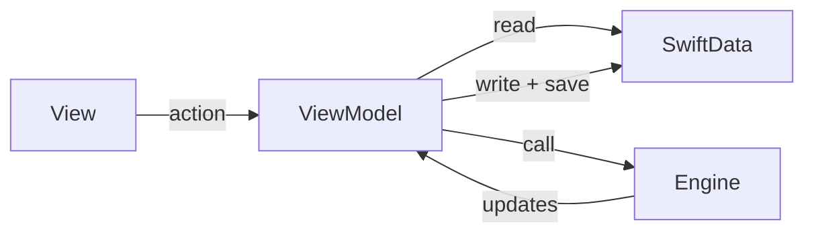

# Budget League Tracker – Architecture

## What the app is

League Keeper (Budget League Tracker) is an iOS app for running and tracking Magic: The Gathering budget leagues. Organizers create multi-week tournaments, add players, record weekly attendance, group players into pods of four, score placement and achievements, and view weekly and final standings. The app targets iOS 18+ and is built with Swift 6, SwiftUI, and SwiftData.

## Tech stack

- **Swift 6** – Language; strict concurrency where applicable.
- **SwiftUI** – All UI; native list styles, controls, and navigation.
- **SwiftData** – Persistence; models are `@Model` types, single `ModelContainer` in the app entry point.
- **XcodeGen** – Project generation from `project.yml`; the Xcode project is generated, not hand-edited for structure.

## Architecture layers

The app is organized into four layers. Data flows one way on actions: View → ViewModel → (Engine) → SwiftData.

- **Data** – SwiftData models in [BudgetLeagueTracker/Models/](BudgetLeagueTracker/Models/): `Player`, `Tournament`, `Achievement`, `LeagueState`, `GameResult`, and supporting types (`Screen`, `ChartData`, etc.). Exactly one `LeagueState` instance exists; it holds the active tournament ID and the current screen for navigation. Each `Tournament` holds metadata (name, total weeks, random achievements per week, dates) and transient weekly state (current week/round, present players, weekly points, active achievements, pod history).

- **Engine** – Business logic in [BudgetLeagueTracker/Engine/](BudgetLeagueTracker/Engine/): `LeagueEngine`, `StatsEngine`, `AchievementStatsEngine`. These provide pure or near-pure functions for scoring, pod generation, and state transitions. They take `ModelContext` and/or plain data; they do not reference SwiftUI. ViewModels call the engine and then apply results back to the context.

- **ViewModels** – One per screen or flow in [BudgetLeagueTracker/ViewModels/](BudgetLeagueTracker/ViewModels/). Each ViewModel bridges the View layer with SwiftData and the Engine: it reads from `ModelContext` or `@Query` (or receives fetched data), exposes state and actions to the View, and implements actions by calling the Engine and writing back to SwiftData. ViewModels do not contain SwiftUI layout; they are testable with an in-memory context.

- **Views** – SwiftUI screens in [BudgetLeagueTracker/Views/](BudgetLeagueTracker/Views/) and reusable components in [BudgetLeagueTracker/Components/](BudgetLeagueTracker/Components/). Views use ViewModels for state and actions and use [AppConstants](BudgetLeagueTracker/Constants/AppConstants.swift) for all numeric and string constants (no magic numbers in UI or business logic).

## Data flow

On user action: the View calls a ViewModel method. The ViewModel reads current state from SwiftData (context or fetched models), optionally calls the Engine to compute updates, then mutates or inserts/deletes models and calls `modelContext.save()`. SwiftUI’s `@Query` and observation keep the UI in sync. There is no separate cache; the ModelContext is the source of truth.

## Key domain concepts

- **Tournament** – A multi-week league season. Has a name, total weeks, random achievements per week, start/end dates, and status (ongoing/completed). While active, it also holds current week, current round, present players for the week, weekly points per player, active achievement IDs, and pod history for undo.

- **Player** – A participant with a name and cumulative stats: placement points, achievement points, wins, games played, and tournaments played. Stats are updated when pods are saved.

- **Achievement** – A named bonus worth a number of points; can be “always on” (counts every week) or rolled randomly per week. Examples: “First Blood,” “Last Stand.”

- **Pod** – A group of four players for one round. Players are assigned placement (1st–4th) and optional achievement checks; saving the pod applies scoring and updates player and weekly totals.

- **Round** – One of three rounds per week. After round 3, the user sees Weekly Standings, then continues to the next week or to Tournament Standings if the tournament is finished.

- **Placement points** – Awarded by finish in a pod: 1st → 4 pts, 2nd → 3 pts, 3rd → 2 pts, 4th → 1 pt. Defined in `AppConstants.Scoring`.

- **Weekly standings** – Current week’s ranking of present players by weekly points (placement + achievement). Shown in a sheet after round 3.

- **Tournament standings** – Final ranking of all players by total placement + achievement points. Shown in a full-screen cover when the tournament is completed.

## Project structure

| Folder | Role |
|--------|------|
| **BudgetLeagueTracker/** | Main app target; all application code lives here. |
| **Models/** | SwiftData `@Model` types: `Player`, `Tournament`, `Achievement`, `LeagueState`, `GameResult`, and supporting types. |
| **Engine/** | Business logic: `LeagueEngine`, `StatsEngine`, `AchievementStatsEngine`. |
| **ViewModels/** | One ViewModel per screen/flow; coordinates View, SwiftData, and Engine. |
| **Views/** | SwiftUI screens (e.g. TournamentsView, PodsView, StatsView). |
| **Components/** | Reusable SwiftUI views: buttons, rows, pickers, empty states, charts. |
| **Constants/** | `AppConstants`: UI (e.g. min touch target), League (ranges, pod size, rounds), Scoring (placement points, defaults), DefaultAchievement. |

The Xcode project is generated from [project.yml](project.yml) at the repo root. Unit and integration tests live in **BudgetLeagueTrackerTests/**; UI tests in **BudgetLeagueTrackerUITests/**.
