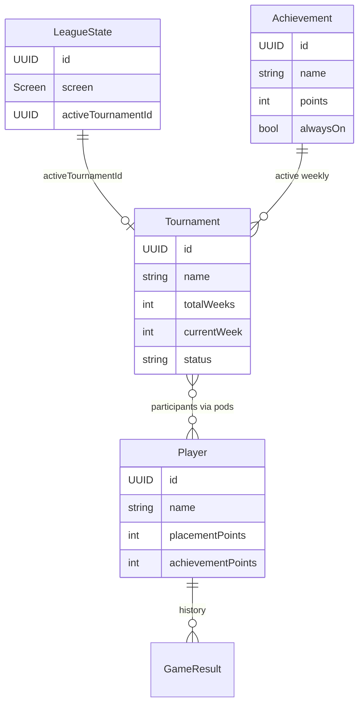

# Data model

SwiftData persistence for League Keeper. **Normative spec:** [specs/DataSchemaSpec.md](../specs/DataSchemaSpec.md).

---

## Overview

All data is **local** on device. One `ModelContainer` in `BudgetLeagueTrackerApp`.

---

## Entities

### LeagueState (singleton)

| Field | Purpose |
|-------|---------|
| `screen` | Current flow screen (`Screen` enum) for navigation |
| `activeTournamentId` | UUID of the tournament in progress |

Exactly one row should exist; `LeagueEngine.validateAndSanitizeState` repairs inconsistencies on launch.

### Tournament

| Field | Purpose |
|-------|---------|
| `name` | Display name |
| `totalWeeks` | Season length (1–99) |
| `randomAchievementsPerWeek` | How many achievements to roll each week |
| `currentWeek` / `currentRound` | Progress within season |
| `status` | `ongoing` or `completed` |
| `presentPlayerIds` | Who attended this week |
| `weeklyPoints` | Map player ID → weekly total |
| `activeAchievementIds` | Achievements available this week |
| `podHistory` | Encoded saved pods for undo/standings |
| `startDate` / `endDate` | Metadata |

Transient weekly state resets when advancing weeks.

### Player

| Field | Purpose |
|-------|---------|
| `name` | Display name (unique in practice) |
| `placementPoints` | Lifetime placement total |
| `achievementPoints` | Lifetime achievement total |
| `wins` | 1st-place pod finishes |
| `gamesPlayed` | Pods played |
| `tournamentsPlayed` | Tournaments participated in |

### Achievement

| Field | Purpose |
|-------|---------|
| `name` | Display name |
| `points` | Point value when earned |
| `alwaysOn` | If true, eligible every week without random roll |

### GameResult

Historical record linking players, tournaments, and outcomes (used in player detail / stats).

---

## Bootstrap (app launch)

On first launch `BudgetLeagueTrackerApp`:

1. Creates default `LeagueState` if missing.
2. Seeds **First Blood** achievement if catalog is empty.
3. Runs `LeagueEngine.validateAndSanitizeState`.

---

## Migration

v1.0 uses a single schema version. Future migrations should:

- Add versioned schemas under a `Persistence/Schemas/` pattern.
- Document in `DataSchemaSpec.md` and add migration tests.

---

## Testing

Use in-memory container via `TestHelpers.bootstrappedContext()` — see [testing.md](testing.md).
