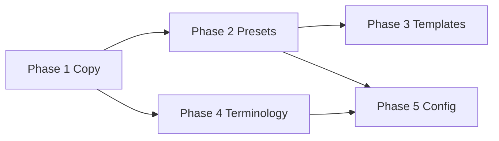

# Generic league positioning — implementation plan

**Last updated:** 2026-06-19  
**Status:** Planned — post–1.0 initiative (Phase 1 may ship as 1.0.x copy-only)  
**Perspective:** Product positioning + incremental UX to serve MTG hosts *and* other recurring league organizers.  
**Strategy:** **MTG-first, broadly usable** — keep Budget Commander as a flagship preset; do not rebrand or remove MTG discoverability.

---

## Executive summary

League Keeper’s **core engine is already generic**: multi-week seasons, attendance, group seating, placement scoring, bonus achievements, standings, and stats. MTG specificity today lives in **marketing copy**, **onboarding**, **default tournament rules** (Budget Commander), and **achievement templates**.

This plan phases work from **low-risk copy** → **preset-based rules** → **template libraries** → **terminology polish** → **optional configurability**. Each phase has clear acceptance criteria so an agent can execute independently.

**Do not block App Store 1.0** on Phases 2–5. Phase 1 copy can land in 1.0.x or alongside 1.0 listing updates.

---

## Goals

| Goal | Success signal |
|------|----------------|
| Non-MTG hosts understand the app in &lt;30 seconds | Onboarding and App Store never require MTG knowledge |
| MTG hosts retain “built for me” feel | Budget Commander preset is one tap; MTG keywords remain in ASO |
| New tournaments feel neutral by default | Create flow opens with simple league rules, not deck budgets |
| Achievement onboarding works for any game night | Generic templates available alongside card-game templates |
| Terminology doesn’t confuse newcomers | User-facing “table” / “group” where “pod” is jargon |

---

## Non-goals

- Rebrand (name stays **League Keeper**)
- Removing tournament rules or Budget Commander support
- Per-tournament achievement catalogs (see [achievement-improvements-plan.md](achievement-improvements-plan.md))
- iCloud sync, export, or backend accounts
- Full localization (English-only for this initiative)
- Replacing the gold/parchment visual identity

---

## Current state (MTG-specific touchpoints)

| Area | MTG-specific today | Key files |
|------|-------------------|-----------|
| App identity | Mostly generic | `BudgetLeagueTracker/Support/AppInfo.swift` |
| Onboarding | “Magic game nights” | `BudgetLeagueTracker/Views/Onboarding/OnboardingView.swift` |
| New tournament default rules | Budget Commander ($75 deck, TCGPlayer, bracket 2, boosters) | `AppConstants.TournamentRulesDefaults`, `NewTournamentViewModel` |
| Tournament rules UI | Commander, “the 99”, TCGPlayer/Moxfield | `TournamentRulesSection.swift`, `TournamentRules.swift` |
| Achievement templates | First Blood, Five-Color Flavor, etc. | `AchievementTemplates.swift` |
| Default seed achievement | “First Blood” | `AppConstants.DefaultAchievement` |
| Sample league | “Kitchen Table League” + MTG achievements | `DemoLeagueLoader.swift` |
| App Store / docs | MTG-first copy and keywords | `docs/app-store-listing.md`, `README.md`, `docs/privacy-policy.md` |
| Domain jargon | “Pod” = group of 4 | `docs/domain-glossary.md`, many views |
| Engine constraint | `podSize == 4` hard-coded | `AppConstants.League.podSize`, `PodEngine.swift` |

**Already generic (no change required):** placement points (4/3/2/1), weekly rounds, standings-based seating, local-only persistence, stats/charts, share standings.

---

## Phase overview

| Phase | Name | Effort | Ship when | Depends on |
|-------|------|--------|-----------|------------|
| **1** | Copy & positioning | Small | 1.0.x or with 1.0 listing | — |
| **2** | League presets (rules) | Medium | 1.1 | — |
| **3** | Achievement template libraries | Medium | 1.1–1.2 | Phase 2 (optional) |
| **4** | Terminology pass (“table” vs “pod”) | Medium | 1.2 | — |
| **5** | Configurable league mechanics | Large | 1.3+ | Phases 2–4 stable |



---

## Phase 1 — Copy & positioning

**Goal:** Frame League Keeper as a weekly league scorekeeper; MTG is the featured preset, not the prerequisite.

### 1.1 In-app copy

| Task | Change | File(s) |
|------|--------|---------|
| **1.1a** Onboarding welcome body | Replace “Magic game nights” with neutral copy, e.g. “Track weekly game nights on this device — who's playing, table seating, finish order, bonus achievements, and standings.” | `OnboardingView.swift` |
| **1.1b** Onboarding step 3 | Keep “tables of four” (accurate for v1); avoid “pod” in onboarding | Same |
| **1.1c** Coach marks / hints | Audit user-visible strings containing “pod”; prefer “table” in new copy only (full pass is Phase 4) | `CoachMarkBanner.swift`, `GeneratePodsCoachMarkStore.swift`, `TournamentDetailViewModel.swift` |
| **1.1d** Empty states | Ensure tournament list / player empty states don't mention MTG | `TournamentsView.swift`, related empty-state components |

**Acceptance:** VoiceOver read-through of onboarding never says “Magic” or “MTG”. Snapshot tests for onboarding updated if baselines drift.

### 1.2 App Store & hosted pages

| Task | Change | File(s) |
|------|--------|---------|
| **1.2a** Subtitle | Prefer generic: e.g. “Weekly leagues, seating & standings” | `docs/app-store-listing.md` |
| **1.2b** Description lead | Lead with generic value prop; second paragraph calls out Budget Commander support | Same |
| **1.2c** Keywords | **Keep** `MTG,magic,...` for ASO; add `board game,game night,tabletop` if space allows (100 char max) | Same |
| **1.2d** Promotional text | Neutral one-liner for non-MTG browsers | Same |
| **1.2e** Privacy & support | Replace “MTG budget leagues” with “recurring game leagues” + mention MTG as common use case | `docs/privacy-policy.md`, `docs/support.md`, regenerate GitHub Pages if published |

**Acceptance:** First sentence of App Store description understandable to a poker-night organizer.

### 1.3 Repo documentation

| Task | File(s) |
|------|---------|
| Update README lede to generic + MTG preset note | `README.md` |
| Add “Positioning” note to architecture intro | `docs/architecture.md` |
| Update `docs/app-store-listing.md` Option A as primary name (not “MTG League Keeper”) | Already documented |

### 1.4 Tests & QA

- Update snapshot tests if onboarding screenshots change: `ScreenSnapshotTests.swift`
- UI test strings: `BudgetLeagueTrackerUITests/` — no assertion on “Magic”
- Manual: read App Store copy aloud to a non-MTG tester persona ([accessibility/audits/2026-06-18-ux-accessibility-audit.md](../accessibility/audits/2026-06-18-ux-accessibility-audit.md) “new host” persona)

**Phase 1 deliverable:** Copy-only PR; no model or engine changes.

---

## Phase 2 — League presets (tournament rules)

**Goal:** New tournaments default to a **Simple League** preset. **Budget Commander** is opt-in via preset picker.

### 2.1 Data model

Introduce a lightweight preset concept (does not need persistence if rules are copied at creation time):

```swift
enum LeaguePreset: String, CaseIterable, Identifiable {
    case simpleLeague
    case budgetCommander
    // future: boardGameNight, custom
}
```

Add factory on `TournamentRules`:

| Preset | Default behavior |
|--------|------------------|
| `simpleLeague` | Entry fee $0, no deck budget fields surfaced, empty playstyle notes, no booster prizes |
| `budgetCommander` | Current `AppConstants.TournamentRulesDefaults.defaultRules` |

**Files:** `TournamentRules.swift`, `AppConstants.swift`

**Migration:** Existing tournaments unchanged (rules already stored on `Tournament`). No SwiftData migration required unless storing `leaguePreset` on `Tournament` for display — optional metadata field.

### 2.2 New tournament UI

| Task | Detail |
|------|--------|
| **2.2a** Preset picker | Section above rules: “League type” with `Simple league` (default) and `Budget Commander (MTG)` |
| **2.2b** Rules form visibility | When `simpleLeague`: collapse/hide deck budget, pricing source, commander/bracket sections; show Entry & Prizes + Playstyle notes only |
| **2.2c** Apply preset | Changing preset resets rules to preset defaults with confirmation if user edited fields |
| **2.2d** Default | `NewTournamentViewModel.rules` initializes to `simpleLeague` preset |

**Files:** `NewTournamentView.swift`, `NewTournamentViewModel.swift`, `TournamentRulesSection.swift` (or split into `TournamentRulesFormSection` + conditional sections)

### 2.3 Edit tournament & detail

| Task | Detail |
|------|--------|
| Show preset badge on tournament detail if metadata stored | `TournamentDetailView.swift` |
| Edit tournament preserves rules; optional preset re-apply | `EditTournamentView.swift` |

### 2.4 Sample league

| Task | Detail |
|------|--------|
| Rename or add second sample | Option A: keep “Kitchen Table League” but use `budgetCommander` rules explicitly. Option B: default sample is generic “Weekly Game Night” with simple rules. **Recommend B** for first-run experience. |

**Files:** `DemoLeagueLoader.swift`, onboarding “Try sample” flow

### 2.5 Tests

| Test | File |
|------|------|
| `simpleLeague` default differs from Budget Commander | `TournamentRulesTests.swift` |
| New tournament VM starts on simple preset | `NewTournamentViewModelTests.swift` |
| Snapshot: new tournament with simple vs BC expanded | `ScreenSnapshotTests.swift` |
| UI test: create tournament without seeing TCGPlayer | `TournamentsScreenTests.swift` |

**Phase 2 deliverable:** Hosts who aren't running Commander never see deck-budget UI unless they opt in.

---

## Phase 3 — Achievement template libraries

**Goal:** Template picker offers **Generic** and **Card game (MTG)** catalogs; default seed achievement is neutral.

### 3.1 Catalog structure

Refactor `AchievementTemplates`:

```swift
enum AchievementTemplateLibrary: String, CaseIterable {
    case generic
    case cardGame  // MTG / Commander flavored
}
```

Move existing templates to `.cardGame`. Add `.generic` catalog (suggested starters):

| Name | Description | Points | Category |
|------|-------------|--------|----------|
| Table Captain | Kept the game moving and helped others | 1 | social |
| Good Sport | Positive attitude win or lose | 1 | social |
| Comeback King | Won from a losing position | 2 | combat |
| Underdog Win | Won while clearly behind | 3 | combat |
| Perfect Round | Flawless or dominant performance | 4 | combat |
| Most Creative | Most creative or memorable play | 2 | chaos |
| Host's Choice | Organizer's pick for standout moment | 2 | social |
| MVP | Best overall contribution this round | 2 | social |

Reuse entries already in catalog where they fit both (`Table Captain`, `Good Sport`, `Underdog Win`, `Perfect Round` — rewrite descriptions to drop combat-damage / life-total MTG framing in generic versions).

**Files:** `AchievementTemplates.swift`, `AchievementTemplatePickerView.swift`

### 3.2 Picker UX

| Task | Detail |
|------|--------|
| Segmented control or section headers: **Generic** / **Card game** | `AchievementTemplatePickerView.swift` |
| Optional: when user chose `budgetCommander` preset in Phase 2, default library tab to Card game | Wire via tournament context or UserDefaults — nice-to-have |

### 3.3 Default seed achievement

| Task | Detail |
|------|--------|
| Replace or supplement “First Blood” | Generic default: **“Table Captain”** or **“Weekly Highlight”**; keep First Blood in card-game catalog only |
| First-launch seed | `AppConstants.DefaultAchievement`, bootstrap in `LeagueEngine` / app launch |

### 3.4 Sample league achievements

Align `DemoLeagueLoader.seedSampleAchievements` with generic templates if sample league goes generic (Phase 2.4).

### 3.5 Tests

- `AchievementTemplates` count and uniqueness per library
- Snapshot: template picker both tabs
- Update tests asserting `First Blood` as global default → new default name

**Phase 3 deliverable:** Achievement add flow serves board-game and MTG hosts without MTG-only names in the default path.

---

## Phase 4 — Terminology pass

**Goal:** User-facing UI says **table** (or **group**); keep **pod** in code, analytics, and internal docs.

### 4.1 Glossary & convention

Update [domain-glossary.md](domain-glossary.md):

| Internal (code) | User-facing (UI) |
|-----------------|------------------|
| Pod | Table |
| Generate Pods | Seat players / Generate tables |
| Pod scoring | Score round |
| onePerPod (exclusivity) | One player per table |

Add `AppConstants.Copy` or `LeagueTerminology` enum for centralized strings if not already present.

### 4.2 String audit scope

Priority surfaces (user-visible):

| Surface | Example current | Target |
|---------|-----------------|--------|
| Tournament detail tabs | “Pods” | “Tables” or “Round” |
| Round flow | “Generate Pods” | “Seat players” |
| Placement picker footer | pod references | table |
| Coach marks | “pod scoring” | “round scoring” |
| Share standings formatter | optional | neutral |
| Accessibility labels | must match visible text | — |

**Do not rename:** Swift types (`PodEngine`), `Screen` enum raw values, Firebase event names (or map display-only).

**Files:** Grep `"[Pp]od"` in `BudgetLeagueTracker/` excluding tests; update user strings. Tab identifiers used by UI tests need coordinated updates in `BudgetLeagueTrackerUITests/`.

### 4.3 Tests

- Full UI test pass: tab names, button labels
- Snapshot re-record for renamed tabs/buttons
- `AccessibilityAuditTests` — label consistency

**Phase 4 deliverable:** A host running a poker league never sees the word “pod” in the UI.

---

## Phase 5 — Configurable league mechanics (optional / later)

**Goal:** Support leagues that aren't 4-player tables or 4/3/2/1 scoring.

### 5.1 Configurable table size

| Task | Detail |
|------|--------|
| Add `playersPerTable: Int` to `Tournament` (default 4) | SwiftData migration |
| Replace `AppConstants.League.podSize` reads with tournament-scoped value in engines | `PodEngine.swift`, `LeagueEngine.swift`, `PlacementPicker.swift` |
| New tournament stepper: “Players per table” (range 2–8) | `NewTournamentView.swift` |
| Update `PodLayoutHint`, odd-roster messaging | `PodLayoutHint.swift` |
| Placement points scale with table size or custom scale | See 5.2 |

**Risk:** High test surface — all pod generation and scoring tests.

### 5.2 Configurable placement points

| Task | Detail |
|------|--------|
| Optional `placementPoints: [Int]` on tournament | Default `[4,3,2,1]` |
| Settings UI: preset scales (Standard, Inverted, Winner-take-all) | Tournament settings |
| Stats engine uses tournament scale | `StatsEngine.swift` |

### 5.3 Preset expansion

| Preset | Table size | Rules | Templates default |
|--------|------------|-------|-------------------|
| Simple league | 4 | Minimal | Generic |
| Budget Commander | 4 | Full BC | Card game |
| Board game night | 4 (or variable) | Minimal | Generic |
| Custom | User-defined | User-defined | User choice |

### 5.4 Tests & migration

- SwiftData migration test for new fields
- Parameterized pod generation tests for sizes 2–8
- Snapshot matrix for 3-player table scoring UI

**Phase 5 deliverable:** App supports non-4-player leagues without workarounds.

---

## Agent handoff checklist

When picking up any phase:

1. **Read first:** [domain-glossary.md](domain-glossary.md), [scoring-rules.md](scoring-rules.md), [navigation.md](navigation.md), this doc.
2. **Confirm phase scope** — do not implement later phases early (especially Phase 5 before presets).
3. **Follow repo conventions:** Swift 6, `@Observable` ViewModels, literals in `AppConstants`, 44pt touch targets, accessibility labels on new controls.
4. **Update docs:** [feature-inventory.md](feature-inventory.md) when user-visible behavior changes; WCAG screen files if copy/a11y changes.
5. **Tests required per phase** (see tables above); re-record snapshots with documented simulator (`SnapshotTestConfiguration.swift`).
6. **PR description:** state phase number, list acceptance criteria met, note MTG regression check (create Budget Commander tournament end-to-end).
7. **Do not commit** unless user asks; match [CONTRIBUTING.md](../CONTRIBUTING.md).

### Suggested PR breakdown

| PR | Contents |
|----|----------|
| PR-A | Phase 1 only (copy + docs + snapshots) |
| PR-B | Phase 2 presets + sample league |
| PR-C | Phase 3 template libraries + default achievement |
| PR-D | Phase 4 terminology (may touch many files — keep isolated) |
| PR-E | Phase 5 (split 5.1 table size and 5.2 scoring if needed) |

---

## Success metrics (post-ship)

Qualitative (beta feedback):

- Non-MTG testers complete sample league without asking “what's a pod?”
- MTG testers still find Budget Commander preset in &lt;2 taps

Quantitative (if analytics enabled):

- `% tournaments created with budgetCommander` vs `simpleLeague`
- Template picker: generic vs card-game selection rate
- Onboarding completion rate unchanged or improved

---

## Related documents

| Doc | Relationship |
|-----|--------------|
| [ios-roadmap.md](ios-roadmap.md) | Post-launch phase slot |
| [achievement-improvements-plan.md](achievement-improvements-plan.md) | Template picker UI already shipped — extend, don't rewrite |
| [app-store-listing.md](app-store-listing.md) | Phase 1 target |
| [docs/release/marketing-screenshots-plan.md](release/marketing-screenshots-plan.md) | Re-shoot screenshots after Phase 1–2 |
| [accessibility/audits/2026-06-18-ux-accessibility-audit.md](../accessibility/audits/2026-06-18-ux-accessibility-audit.md) | “New host” persona — jargon findings |

---

## Open questions (resolve before Phase 2 PR)

| # | Question | Default if no answer |
|---|----------|----------------------|
| Q1 | Store `leaguePreset` on `Tournament` for badge/display? | Yes — optional string field |
| Q2 | Single sample league or picker (Generic vs MTG sample)? | Single generic sample for v1.1 |
| Q3 | Tab rename “Pods” → “Tables” or “Round”? | **Round** avoids collision with physical table count |
| Q4 | Phase 1 ship before or after App Store 1.0? | After 1.0 submit; update listing before public release if possible |
