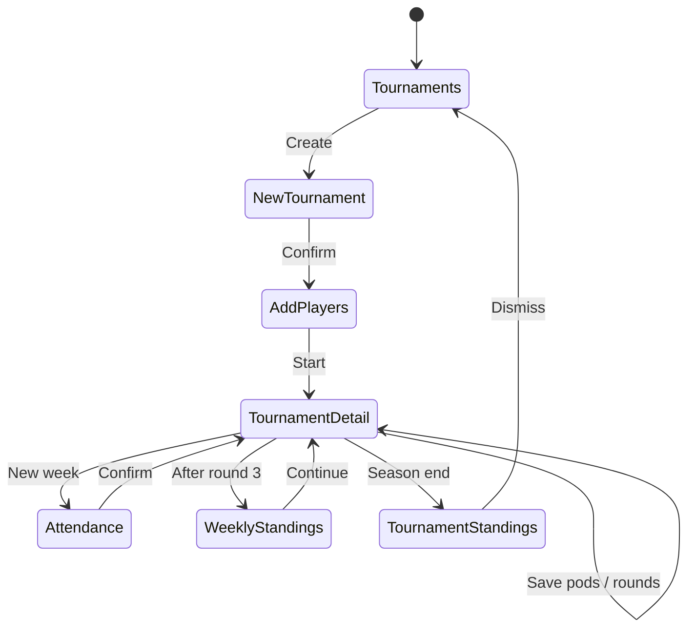

# Navigation

How users move through League Keeper. **Normative spec:** [specs/NavigationSpec.md](../specs/NavigationSpec.md).

---

## Tab bar (always available unless hidden)

| Tab | Root view | Stack |
|-----|-----------|-------|
| Tournaments | `TournamentsView` | `NavigationStack` → `TournamentDetailView` |
| Players | `PlayersView` | → `PlayerDetailView` |
| Stats | `StatsView` | Single screen |
| Achievements | `AchievementsView` | Sheet: `NewAchievementView` |
| Settings | `SettingsView` | Single screen |

Tab bar is **hidden** during certain flows (`NavigationState.shouldHideTabBar`) — e.g. new tournament, attendance, add players.

---

## Screen-driven flows (`LeagueState.screen`)

Persisted in `LeagueState.currentScreen`:

| Screen | View | Notes |
|--------|------|-------|
| `.tournaments` / `.dashboard` | `TournamentsView` | Default landing |
| `.newTournament` / `.confirmNewTournament` | `NewTournamentView` | Full-screen flow |
| `.addPlayers` | `AddPlayersView` | After confirm |
| `.attendance` | `AttendanceView` | Weekly attendance (also sheet from detail) |
| `.tournamentDetail` | Via navigation push | Not always set on enum |
| `.tournamentStandings` | `TournamentStandingsView` | Full-screen cover |

`ContentView` switches the tournaments stack content based on `currentScreen`.

---

## Sheets & covers

| Presentation | View | Trigger |
|--------------|------|---------|
| Sheet | `EditLastRoundView` | Tournament detail → edit last pod |
| Sheet | `AttendanceView` | Tournament detail → attendance |
| Sheet | `EditTournamentView` | Tournaments list → edit |
| Sheet | `NewAchievementView` | Achievements → add |
| Full-screen cover | `TournamentStandingsView` | Tournament completes |

---

## State diagram (core flow)

---

## Implementation files

- [ContentView.swift](../BudgetLeagueTracker/ContentView.swift) — TabView + stack wiring
- [Models/Screen.swift](../BudgetLeagueTracker/Models/Screen.swift) — Screen enum
- [Models/LeagueState.swift](../BudgetLeagueTracker/Models/LeagueState.swift) — Persisted navigation
- [NavigationStateTests](../BudgetLeagueTrackerTests/NavigationStateTests.swift) — Routing unit tests

---

## UI test navigation

`UITestHelpers` provides `navigateToTournaments()`, `navigateToPlayers()`, etc. Launch arg: `--uitesting` (disables Firebase).
