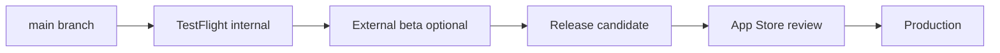

# Release documentation

Guides for shipping League Keeper to TestFlight and the App Store.

---

## Documents

| Doc | Purpose |
|-----|---------|
| [testflight.md](testflight.md) | Beta distribution setup |
| [1.0-ship-checklist.md](1.0-ship-checklist.md) | Pre-submission gate |
| [todo.md](todo.md) | Open release tasks |
| [marketing-screenshots-plan.md](marketing-screenshots-plan.md) | Screenshot automation (future work; Dart Buddy pattern) |
| [ipad-layout-plan.md](../ipad-layout-plan.md) | iPad & landscape implementation checklist |

---

## Release train (1.0)

| Stage | Gate |
|-------|------|
| TestFlight internal | CI green, app runs on device, iPad Phase A QA started |
| External beta | Manual VO checklist started; iPad Phase A complete |
| App Store submit | [1.0-ship-checklist.md](1.0-ship-checklist.md) complete |

---

## Versioning

- **1.0.0** — First App Store release
- Build number increments every archive upload
- Changelog: [CHANGELOG.md](../../CHANGELOG.md)

---

## Related

- [specs/AppStoreConnectSpec.md](../../specs/AppStoreConnectSpec.md)
- [specs/iPadLayoutSpec.md](../../specs/iPadLayoutSpec.md)
- [docs/app-store-listing.md](../app-store-listing.md)
- [docs/ipad-layout-plan.md](../ipad-layout-plan.md)
- [docs/ios-roadmap.md](../ios-roadmap.md)
